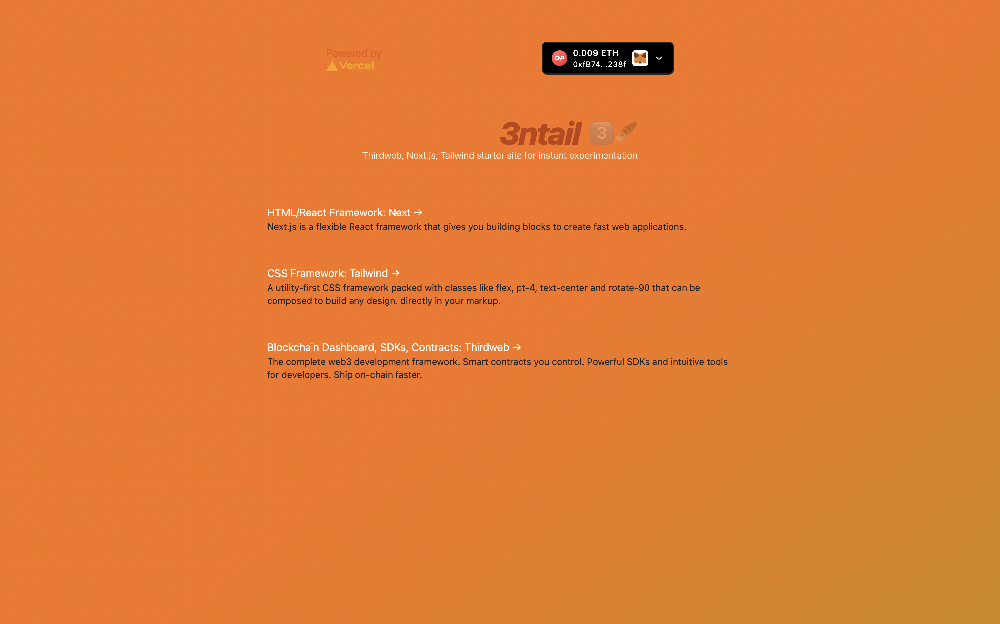

This is a [Next.js](https://nextjs.org/) project bootstrapped with [`create-next-app`](https://github.com/vercel/next.js/tree/canary/packages/create-next-app), [`thirdweb`](https://thirdweb.com/) [`Tailwindcss`](https://tailwindcss.com/docs/guides/nextjs) with the goal of making simpler starting points for blockchain app development.

## 3ntail 3️⃣🪶

> Install this starter kit to get building dapp frontends even faster 



---

## Quickstart

1. Install the *3ntail* package...

```
npx @pryority/3ntail@latest <YOUR_APP_NAME or . to use the current directory name>
```
- or clone the *GitHub repo* in a fresh directory
```
git clone https://github.com/pryority/3ntail.git
cd nemiwind && yarn install
```

2. Install the package dependencies into your local repo

```
yarn dev
```

3. Run the Next.js web in the browser

```
yarn start
```
- Open [http://localhost:3000](http://localhost:3000) with your browser to see the result.

- You can start editing the page by modifying `pages/index.tsx`. The page auto-updates as you edit the file.

## Learn More

To learn more about Next.js, take a look at the following resources:

- [Next.js Documentation](https://nextjs.org/docs) - learn about Next.js features and API.
- [Learn Next.js](https://nextjs.org/learn) - an interactive Next.js tutorial.
- [Learn Thirdweb](https://thirdweb.com/) - the Thirdweb documentation.
- [Learn Tailwind](https://tailwindcss.com/docs/guides/nextjs) - the Tailwind installation process for Next.js.

## Deploy on Vercel

The easiest way to deploy your Nemiwind app is to use the [Vercel Platform](https://vercel.com/new?utm_medium=default-template&filter=next.js&utm_source=create-next-app&utm_campaign=create-next-app-readme) from the creators of Next.js.

Check out the [Next.js deployment documentation](https://nextjs.org/docs/deployment) for more details.
